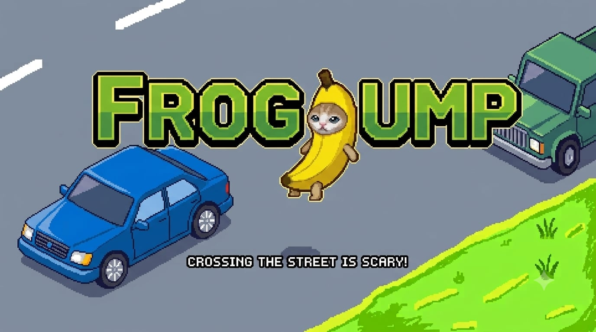

<div align="center">

# 🐸 FROG JUMP GAME - STM32F429I-DISCO

[](https://www.st.com/en/evaluation-tools/32f429idiscovery.html)
[](https://www.st.com/en/embedded-software/x-cube-touchgfx.html)
[](https://www.st.com/en/development-tools/stm32cubeide.html)
[](https://www.st.com/en/development-tools/stm32cubemx.html)
[]()

<br/>

<br/>

</div>

---

## 🌟 1. Giới thiệu

**Frog Jump** là dự án game lấy cảm hứng từ game Frogger, được thiết kế và tối ưu hoá cho dòng vi điều khiển nhúng hiệu năng cao **STM32F429I-DISCO** của STMicroelectronics. Dự án là sự kết hợp hoàn hảo giữa nền tảng đồ hoạ hiện đại **TouchGFX 4.26.1**, hệ điều hành thời gian thực **FreeRTOS** và hệ thống điều khiển ngoại vi mức thấp **STM32 HAL Driver**.

Trong game, người chơi sẽ điều khiển nhân vật Mèo khéo léo nhảy qua các khúc gỗ trên dòng sông, né tránh xe cộ đang lưu thông tấp nập trên đường phố, đồng thời thu thập những cọc tiền dollar và hướng tới bờ bên kia để đạt được điểm số.

### Điểm nổi bật kỹ thuật của dự án:
- **🎨 Đồ hoạ mượt mà**: Khai thác tối đa sức mạnh của bộ điều khiển màn hình **LTDC** và bộ tăng tốc đồ hoạ phần cứng **DMA2D** trên màn hình TFT LCD 2.4" 240x320.
- **🎧 Âm thanh sống động**: Tích hợp bộ quản lý hiệu ứng âm thanh PCM 16-bit (`jump`, `cash`, `crash`, `game_over`) phát thẳng từ bộ nhớ Flash ra chip DAC **CS43L22** thông qua giao thức **I2S3 kết hợp DMA (`DMA1_Stream5`)**, đảm bảo không gây lag giao diện.
- **⏱️ Quản lý đa luồng thời gian thực (FreeRTOS)**: Phân chia rõ ràng giữa luồng quét phím điều khiển và luồng hiển thị giao diện đồ hoạ TouchGFX.

---

## ⚙️ 2. Yêu cầu phần cứng & Cấu hình chân

### 🖥️ Yêu cầu phần cứng
- **Bo mạch phát triển**: [STM32F429I-DISCO](https://www.st.com/en/evaluation-tools/32f429idiscovery.html) (Cores ARM Cortex-M4 @ 180 MHz, 2MB Flash, 256KB SRAM, tích hợp 64Mbit SDRAM và ST-LINK/V2-B).
- **Màn hình hiển thị**: TFT LCD 2.4" độ phân giải 240x320 pixels (tích hợp IC điều khiển ILI9341 và cảm ứng điện trở STMPE811).
- **Âm thanh**: Loa 3W nối với mạch khuếch đại DAC MAX98357A.
- **Nút bấm**: 4 nút bấm 4 chân và các dây nối.

### 📌 Bảng cấu hình chân ngoại vi (Pinout Mapping)

#### 🎮 Nút bấm điều khiển (`StartDefaultTask` - Polling 50 Hz)
| Chân GPIO | Tên tín hiệu | Chức năng điều khiển | Cơ chế hoạt động |
| :---: | :---: | :--- | :--- |
| **`PA7`** | `CAT_LEFT` | Nhảy sang trái | Active Low + Auto-repeat 10 Hz (sau hold 300 ms) |
| **`PA5`** | `CAT_UP` | Nhảy tiến lên phía trước | Active Low + Auto-repeat 10 Hz (sau hold 300 ms) |
| **`PG3`** | `CAT_DOWN` | Nhảy lùi ra phía sau | Active Low + Auto-repeat 10 Hz (sau hold 300 ms) |
| **`PG2`** | `CAT_RIGHT` | Nhảy sang phải | Active Low + Auto-repeat 10 Hz (sau hold 300 ms) |

#### 🔊 Ngoại vi phát âm thanh (`I2S3` & `DMA1_Stream5`)
| Chân GPIO | Chức năng I2S3 | Cấu hình Alternate Function | Mô tả |
| :---: | :---: | :---: | :--- |
| **`PA15`** | `I2S3_WS` | `GPIO_AF6_SPI3` | Word Select (LRCK) - Chu kỳ chuẩn 16 kHz |
| **`PC10`** | `I2S3_CK` | `GPIO_AF6_SPI3` | Bit Clock (SCK) - Xung nhịp dịch dữ liệu |
| **`PC12`** | `I2S3_SD` | `GPIO_AF6_SPI3` | Serial Data (MOSI) - Dòng dữ liệu PCM 16-bit ra DAC |

---

## 🛠️ 3. Các công cụ phát triển cần có

Để có thể phát triển, biên dịch và nạp mã nguồn dự án thành công, bạn cần cài đặt đầy đủ các bộ công cụ phần mềm sau:

1. **[STM32CubeIDE (v2.1.1)](https://www.st.com/en/development-tools/stm32cubeide.html)**: Môi trường phát triển tích hợp chính (IDE) hỗ trợ biên dịch mã nguồn C/C++, quản lý bộ nhớ và gỡ lỗi (Debug) cho vi điều khiển STM32.
2. **[TouchGFX Designer (v4.26.1)](https://www.st.com/en/embedded-software/x-cube-touchgfx.html)**: Công cụ thiết kế giao diện đồ hoạ trực quan, quản lý tài nguyên hình ảnh/font chữ và tự động sinh mã nguồn C++ (`Application/User/TouchGFX/generated`).
3. **[STM32CubeMX (Hardware Config)](https://www.st.com/en/development-tools/stm32cubemx.html)**: Phần mềm cấu hình phần cứng, xung nhịp (`SystemClock_Config` 180 MHz, `PLLI2S` 96 MHz), thiết lập ngoại vi (I2S, DMA, LTDC) và hệ điều hành FreeRTOS.

---

## ⚡ 4. Hướng dẫn Setup

### 📥 Bước 1: Tải mã nguồn project
Mở Terminal / Git Bash tại thư mục làm việc của bạn và chạy lệnh:
```bash
git clone https://github.com/3XChehe/Frog-jump.git
cd Frog-jump
```

### 🎨 Bước 2: Sinh mã giao diện đồ hoạ (Generate TouchGFX Code)
> [!IMPORTANT]
> Đây là bước bắt buộc mỗi khi clone project về máy hoặc khi có cập nhật hình ảnh trong `TouchGFX/assets/images/`.

1. Điều hướng vào thư mục `TouchGFX/` và nhấp đúp vào file **`FrogJumpProject.touchgfx`** (hoặc `STM32F429I_DISCO_REV_D01.touchgfx`) để mở bằng **TouchGFX Designer**.
2. Trên giao diện TouchGFX Designer, nhấn phím **`F4`** (hoặc click vào nút **Generate Code** ở góc trên bên phải màn hình).
3. Chờ công cụ tự động chuyển đổi tài nguyên và sinh ra toàn bộ mã nguồn C++ vào thư mục `TouchGFX/generated/`. Sau khi hoàn tất, bạn có thể đóng TouchGFX Designer.

### 🔧 Bước 3: Cập nhật cấu hình phần cứng từ STM32CubeMX (Generate IOC Code)

1. Nhấp đúp vào file cấu hình **`STM32F429I_DISCO_REV_D01.ioc`** ở thư mục gốc để mở bằng **STM32CubeMX**.
2. Kiểm tra các thiết lập:
   - **Clock Configuration**: `SYSCLK` = 180 MHz, `PLLI2S` = 96 MHz.
   - **Multimedia -> I2S3**: `Half-Duplex-Master`, `16-bit Data on 16-bit Frame`, `Audio Frequency = 16 KHz`.
3. Nhấp vào nút **GENERATE CODE** ở góc trên cùng bên phải để cập nhật các file khởi tạo cấu hình trong `Core/Src/` và `Core/Inc/`.

### 🔨 Bước 4: Biên dịch và Nạp (Build & Flash)
1. Khởi động **STM32CubeIDE**, trên thanh menu chọn **File** $\rightarrow$ **Import...**
2. Chọn **General** $\rightarrow$ **Existing Projects into Workspace** và nhấn **Next**.
3. Ở dòng *Select root directory*, nhấn **Browse...**, trỏ đến thư mục `STM32CubeIDE/` bên trong project và chọn project **`STM32F429I_DISCO_REV_D01`** rồi bấm **Finish**.
4. Nhấp chuột phải vào tên project **`STM32F429I_DISCO_REV_D01`** trong bảng **Project Explorer** bên trái:
   - Chọn **Clean Project** để xóa các file dịch cũ.
   - Chọn **Build Project** (hoặc nhấn phím tắt `Ctrl + B`) để tiến hành biên dịch toàn bộ mã nguồn C/C++.
5. Cắm cáp mini-USB từ bo mạch STM32F429I-DISCO vào máy tính.
6. Nhấn nút **Run / Debug** (`F11 / Ctrl + F11`) trên thanh công cụ STM32CubeIDE để nạp chương trình xuống vi điều khiển và bắt đầu trải nghiệm game!

---

## 📂 5. Cấu trúc thư mục

```text
Frog-jump/
├── Core/                              # Mã nguồn chính của vi điều khiển (Application Core)
│   ├── Inc/                           # Thư viện Header (.h): main.h, FreeRTOSConfig.h, stm32f4xx_it.h...
│   └── Src/                           # Mã nguồn C (.c): main.c (quét phím StartDefaultTask), hal_msp.c...
│
├── Drivers/                           # Bộ thư viện điều khiển mức thấp (Hardware Drivers)
│   ├── BSP/                           # Board Support Package (hỗ trợ màn hình ILI9341 & cảm ứng STMPE811)
│   ├── CMSIS/                         # Thư viện lõi ARM Cortex-M4 và định nghĩa thanh ghi chip
│   └── STM32F4xx_HAL_Driver/          # Thư viện HAL & LL Driver chính chủ từ STMicroelectronics
│
├── Middlewares/                       # Thư viện phần mềm trung gian
│   └── FreeRTOS/                      # Hệ điều hành thời gian thực FreeRTOS Kernel V10.3.1
│
├── TouchGFX/                          # Toàn bộ hệ thống đồ hoạ và logic game TouchGFX
│   ├── App/                           # Cấu hình khởi tạo và cấu hình bộ nhớ màn hình
│   ├── assets/                        # Tài nguyên thô của dự án (mã hóa khi Generate)
│   │   ├── fonts/                     # Font chữ TTF sử dụng trong game
│   │   └── images/                    # Các hình ảnh sprite PNG (.png) và banner (.jpg)
│   ├── generated/                     # Mã nguồn C++ tự động sinh ra bởi TouchGFX Designer (CẢNH BÁO: Không sửa tay)
│   ├── gui/                           # Mã nguồn logic giao diện game do người dùng viết C++ (MVC Pattern)
│   │   ├── include/gui/               # Header C++ cho từng màn hình và SoundManager
│   │   └── src/                       # Source C++ xử lý logic game:
│   │       ├── screen1_screen/        # Màn hình Start / Menu game
│   │       ├── screen2_screen/        # Màn hình Gameplay chính (xử lý va chạm, điểm số, nhảy ếch)
│   │       ├── screen3_screen/        # Màn hình Game Over / Bảng kỷ lục
│   │       ├── common/                # Các thành phần chung toàn hệ thống
│   │       └── sound/                 # Quản lý phát âm thanh Non-Blocking (SoundManager.cpp & mảng PCM Flash)
│   │
│   └── target/                        # Mã nguồn kết nối TouchGFX với phần cứng HAL (DMA2D, GPIO, Touch)
│
├── STM32CubeIDE/                      # Thư mục chứa cấu hình Project của Eclipse / STM32CubeIDE (.project, .cproject)
├── STM32F429I_DISCO_REV_D01.ioc       # File cấu hình đồ hoạ cho STM32CubeMX
└── README.md                          # Tài liệu hướng dẫn sử dụng và thông tin kỹ thuật của dự án
```